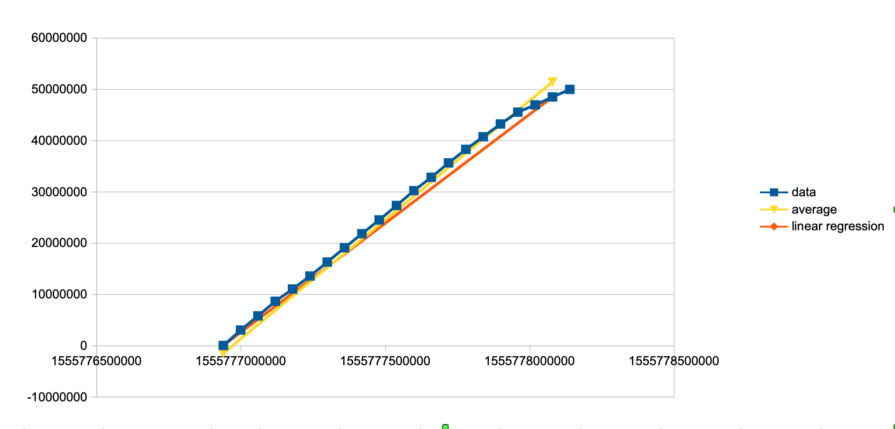

## Average vs. Linear Regression

The monitor tools work by collecing samples of time and count.

For example: KafkaTopicMon
- connects to a Kafka Topic and retrieves a current count of the topic
- get a count every 10 seconds; this time interval can be set with a command line input
- when the count starts to change a sample is collected (epoch time of system) and count
- as long as count continues to create another sample is collected every 10 seconds
- when count stops increasing the tool outputs a summary and resets 

Here is an example output.

```
Watching for changes in count...  Use Ctrl-C to Exit.
|Sample Number|Epoch|Count|Linear Regression Rate|Approx. Instantaneous Rate|
|-------------|-----|-----|----------------------|--------------------------|
| 1 | 1556025409809 | 1405960 |           |           |
| 2 | 1556025414755 | 3789719 | 481957 | 481957 |
| 3 | 1556025419755 | 6602556 | 522554 | 562567 |
| 4 | 1556025424755 | 9069591 | 517774 | 493407 |
| 5 | 1556025429755 | 11587604 | 513980 | 503603 |
| 6 | 1556025434754 | 14087273 | 510903 | 500034 |
| 7 | 1556025439755 | 16582439 | 508521 | 498933 |
| 8 | 1556025444755 | 19050937 | 506292 | 493700 |
| 9 | 1556025449755 | 21565719 | 505031 | 502956 |
| 10 | 1556025454754 | 24080347 | 504279 | 503026 |
| 11 | 1556025459755 | 25000000 | 489292 | 183894 |
Count is no longer increasing...
Removing sample: 1556025459755|25000000
Total Count: 25,000,000 | Linear Regression Rate:  504,279 | Average Rate: 504,492
```

The format of the sample data has pipes `|`; makes the data eay to copy and paste into Github.

- Sample Number: Is literally the sample number for this test run starting with 1.
- Epoch: System time with count was made in milliseconds from epoch (midnight on 1 Jan 1970)
- Count: The change in the count for this run (e.g. 1405960 means count has increased by 1,405,960).
- Linear Regression Rate: This is a best fit linear line to the sample data. To learn more see [tutorial](https://www.khanacademy.org/math/statistics-probability/describing-relationships-quantitative-data/introduction-to-trend-lines/a/linear-regression-review)
- Appox. Instaneous Rate: Is Average rate between this current sample and previous sample.

When count stops increasing a summary is printed.

The last sample is removed.  This needs to be removed since the data may have stopped anytime between this sample and the previous sample. You can see in the Approx. Instanteous Rate above that the last rate was much lower than previous samples.  

The summary also outputs the total count received. This is useful to verify that the count send is the same as count received.  

The Average Rate in summary is from sample 1 to sample before the last. In thie table above from sample 1 to sample 10.

If the data is linear the rates should be should be approximately (with 10%) the same. 

The follow graph shows an difference of average vs. linear regression.  

**NOTE:** The data in the graph was from a different test run than above.


